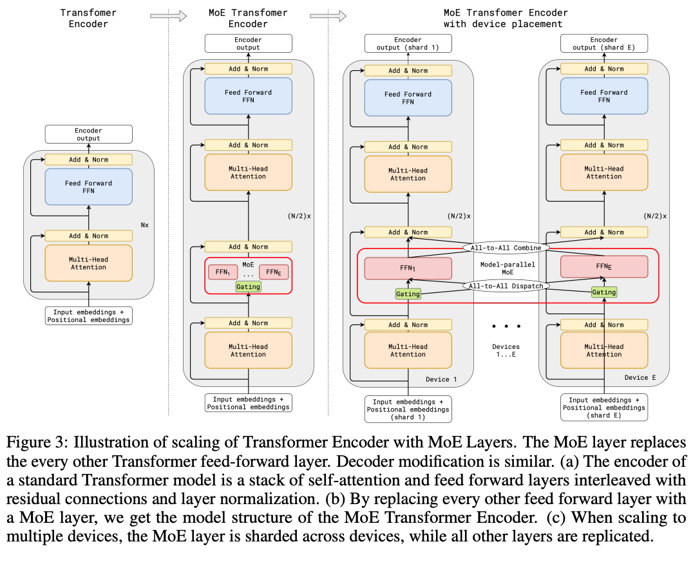
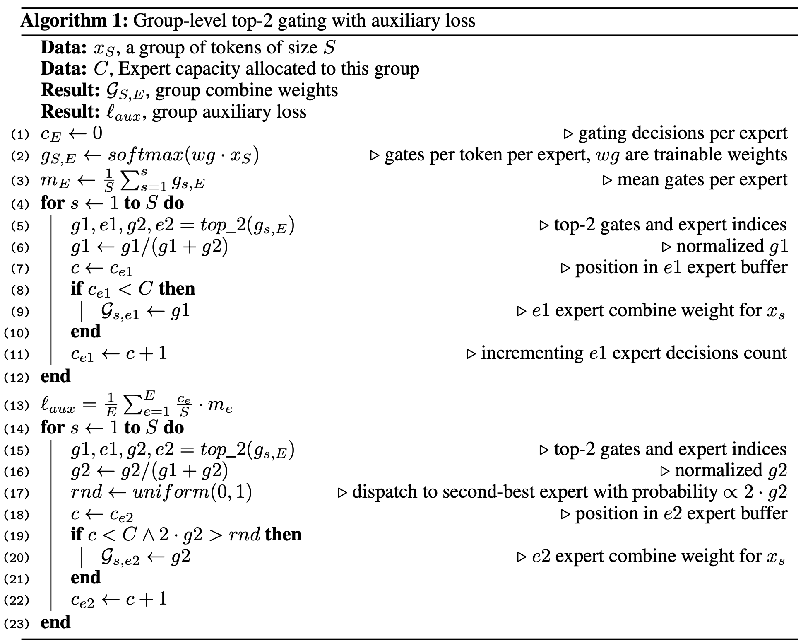

# G-Shard
Paper link: [ArXiv 2020](https://arxiv.org/abs/2006.16668)

## Architecture
The G-Shard MoE architecture (see Fig.1) consists of a transformer _MoE-fied_ as follows:

* Every other feed-forward layer in the transformer is replaced with a MoE layer
* MoE layers use a parallelized Top2 gating function described in more detailed in the [section below](#gating-function)
* Experts consist of 2 fully-connected FFN with ReLu activation
* The output of each MoE layer is the average of the output of all experts

Fig.1 - The G-Shard MoE architecture

## Gating function
The full gating algorithm is available below (see Algorithm. 2):

1. The G-Shard gating function is parallelized using **local group dispatching**: the N tokens in a batch are evenly subdivided into G groups, each processing N/G tokens and routing them to the expert using a $\frac{2N}{G \cdot E}$ expert capacity. 
2. The Top2 function tentatively assigns each token to 2 experts; if the expert capacity is exceeded for $\underline{both}$ experts, the token is marked as overflow and passed to the following layer using a residual connection. 
3. To balance the tokens among the experts, an auxiliary loss term is used. Ideally, we'd want to add a term that minimizes the mean square of the fradction of tokens routed to each expert, but this expression is not differentiable since it involves the Top2 function, so we use an approximation involving the mean gates per experts.

Algorithm 1 - The G-Shard gating algorithm

## Einsums
Much of the G-Shard MoE layer implementation uses the einsum notation. An easy-to-understand overview of einsums in Python is available at [this link](https://ajcr.net/Basic-guide-to-einsum/)
