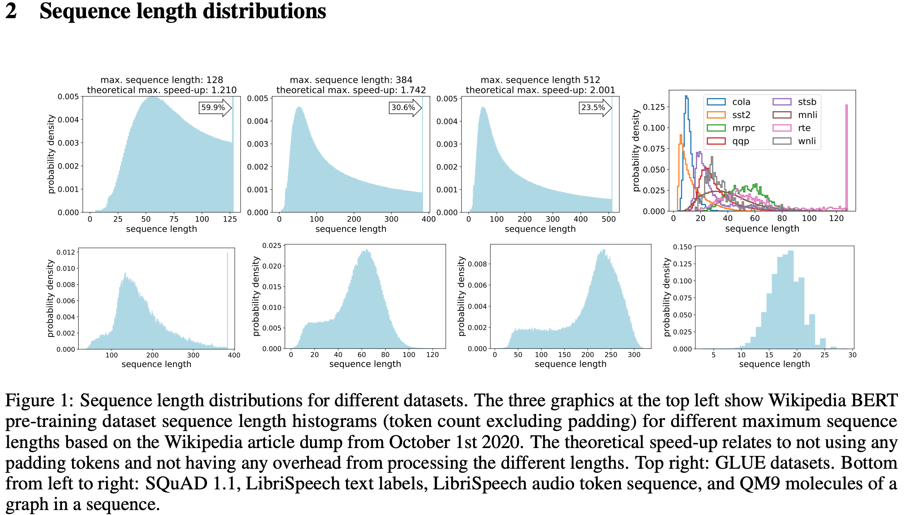

Inference Requests traces
=========================

To evaluate the systems performance (throughtput & latency) of a serving
system, we need a real or synthesized trace of client requests.

Orca approach
-------------

The authors of the `ORCA
paper <https://www.usenix.org/conference/osdi22/presentation/yu>`__
performed the end-to-end evaluation of their serving system using a
simulated workload, which they generated as follows. First, the arrival
rate of the requests is modeled using a Poisson process with various
values of :math:`\lambda`. As a consequence, the arrival time
:math:`t_k` of the :math:`k`-th request :math:`r_k` can be simulated by
sampling from the Erlang distribution:

.. math:: T=\{t_1,..., T_N\} \sim Erlang(k, \lambda) 

The PDF of the Erlang distribution is as follows:

.. math:: p_{T_k} = P(T_k=t)=\frac{\lambda^kt^{k-1}e^{-\lambda t}}{(k-1)!}

More practically, we can simulate each request arrival time :math:`t_k`,
using just a uniform random number generator and the formula:

.. math:: t_k=-(1/k)\sum_{i=1}^k\log{u_i}

where :math:`u_i` is the :math:`i`-th random number generated from the
uniform distribution :math:`U \sim Uniform([0,1])`

Next the number of input tokens :math:`n_k` and the number of tokens to
generate (:math:`g_k`) as output in each request are determined by
sampling from the following uniform distributions:

.. math:: n_k \sim Uniform([32,512])

.. math:: g_k \sim Uniform([1,128])

In summary, each request :math:`r_k` is generated using the three
parameters :math:`t_k` (arrival time), :math:`n_k` (# input tokens) and
:math:`g_k` (# output tokens). The authors did not specify which values
they used for :math:`\lambda`, nor how the input tokens were generated.

Proposed approach
-----------------

To evaluate the performance of our system, we could use a similar
approach as above to generate the arrival times. When it comes to 
generating the samples to be used for each request, instead of 
generating input samples with artificially with arbitrary length (like
the Orca approach, with :math:`n_k` tokens sampled from a uniform
distribution), we could simply use a public NLP dataset such as
``wikitext-103`` and larger ones, and shuffle the entries before creating
the requests. We can then report the results for datasets that have different 
distributions of sequence lengths. For instance, Fig.1 below (`from
here <https://arxiv.org/pdf/2107.02027.pdf>`__ ) shows the sequence length
distribution for different datasets.

Fig.1 - The sequence length distributions for different datasets

